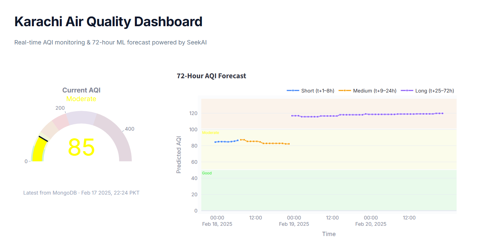
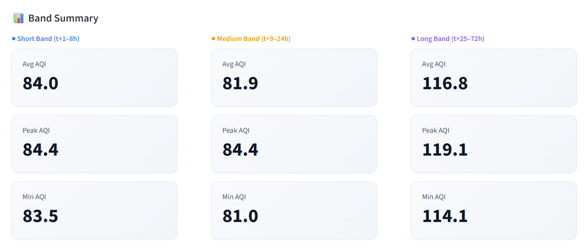
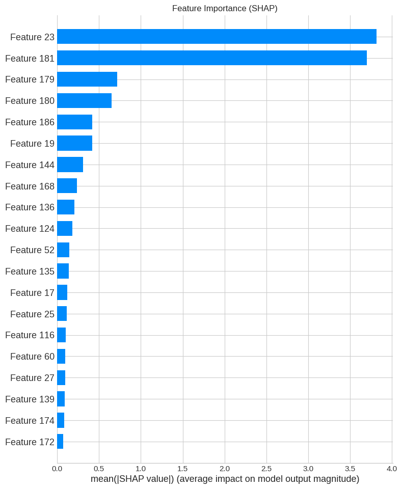

# AQI SeekAI

**Real-time Air Quality Monitoring & 72-Hour Forecast for Karachi**

[](https://aqi-seek786.streamlit.app)
[](https://github.com/SeekAI-786/AQI_Predictor/actions)

---

## What It Does

- Collects **35 weather & air quality variables** hourly from Open-Meteo APIs
- Engineers **186+ features** and stores them in MongoDB Atlas
- Trains **3-band LightGBM models** (short/medium/long horizon) every 12 hours
- Serves a **5-page Streamlit dashboard** with real-time AQI, 72h forecast, historical data, EDA, and model metrics

Everything runs serverlessly on free-tier services — **$0/month**.

## Live Demo

**[aqi-seek786.streamlit.app](https://aqi-seek786.streamlit.app)**

## Architecture

```
Open-Meteo APIs ──► hourly_pipeline.py (cron: every hour at :10)
                        │
                        ▼
                   MongoDB Atlas
                   ├─ aqi_feature_store.karachi_aqi_features
                   └─ aqi_model_store.pearls_72h_models
                        │                    ▲
                        ▼                    │
                   streamlit_app.py     retrain_pipeline.py
                   (Streamlit Cloud)    (cron: every 12h at :30)
```

## Model Performance

| Band | Horizons | R² | RMSE |
|:-----|:---------|:---|:-----|
| Short | t+1–8h | 0.9183 | 6.69 |
| Medium | t+9–24h | 0.3721 | 18.55 |
| Long | t+25–72h | -0.4336 | 27.55 |

Best: t+1h R²=0.98 · Worst: t+72h R²=-0.68

## Implementation

The system is implemented as a fully automated, serverless pipeline designed for continuous AQI prediction and model improvement.

### 1. Data Collection
Weather and pollutant data (temperature, humidity, PM2.5, PM10, NO₂, SO₂, CO, ozone, aerosol optical depth, etc.) are collected using the **Open-Meteo API** — 18 weather variables and 17 air quality variables per hour.

- `api_data_fetch.py` handles historical data fetching for initial dataset creation.
- Data is stored in **MongoDB Atlas** (`aqi_feature_store.karachi_aqi_features`).

### 2. Hourly Data Ingestion & Feature Engineering
- `hourly_pipeline.py` runs **every hour** (automated via GitHub Actions at minute :10).
- Fetches last 3 hours of data from Open-Meteo, deduplicates against MongoDB, and engineers **186+ features** (rolling means, lags, cyclical time encodings, interactions, autoregressive AQI features).
- Uploads only new records to the MongoDB feature store, ensuring the model always has access to the latest data.

### 3. Model Training
- `retrain_pipeline.py` pulls all data from MongoDB and trains **3-band LightGBM models** (short: t+1–8h, medium: t+9–24h, long: t+25–72h).
- Each band uses 192 input features (186 engineered + 5 autoregressive + 1 horizon encoding).
- Trained models are serialized via pickle, base64-encoded, and stored in **MongoDB Atlas** (`aqi_model_store.pearls_72h_models`).
- Training runs automatically **every 12 hours** via GitHub Actions (at minute :30, after the hourly pipeline).

### 4. Deployment & Visualization
- `streamlit_app.py` serves the trained model through a **Streamlit web dashboard** deployed on Streamlit Community Cloud.
- The dashboard shows:
  - Current AQI value with color-coded gauge
  - 72-hour AQI forecast with 3-band visualization
  - Historical AQI trends with date filtering
  - EDA analytics (distribution, correlation, heatmaps)
  - Model performance metrics and architecture details

### 5. Continuous Automation
The pipeline is fully automated using **GitHub Actions**:
- **Hourly** — Data ingestion + feature engineering (`hourly_api_fetch.yml`)
- **Every 12 hours** — Model retraining + evaluation (`aqi_72h_retrain.yml`)

This setup enables the project to remain **serverless and maintenance-free** at $0/month.

---

## Setup

### Prerequisites

- Python 3.11+
- MongoDB Atlas account (free tier)
- GitHub account (for Actions CI/CD)

### Local Development

```bash
git clone https://github.com/SeekAI-786/AQI_Predictor.git
cd AQI_Predictor
python -m venv venv
venv\Scripts\activate        # Windows
# source venv/bin/activate   # Linux/Mac
pip install -r requirements.txt
```

Create a `.env` file:

```env
MONGODB_URI=mongodb+srv://<user>:<pass>@<cluster>.mongodb.net/
```

Run the dashboard:

```bash
streamlit run streamlit_app.py
```

### GitHub Actions (CI/CD)

Add these repository secrets:

| Secret | Description |
|:-------|:------------|
| `MONGODB_URI` | MongoDB Atlas connection string |
| `MONGODB_DB` | Feature store DB name (default: `aqi_feature_store`) |
| `MONGODB_COLLECTION` | Feature collection (default: `karachi_aqi_features`) |
| `MODEL_DB` | Model store DB name (default: `aqi_model_store`) |
| `MODEL_COL` | Model collection (default: `pearls_72h_models`) |

### Streamlit Cloud Deployment

1. Connect your GitHub repo on [share.streamlit.io](https://share.streamlit.io)
2. Set main file to `streamlit_app.py`
3. Add `MONGODB_URI` in the app's Secrets settings

## Project Structure

```
├── streamlit_app.py         # Dashboard (5 pages, 914 lines)
├── hourly_pipeline.py       # Hourly data ingestion & feature engineering
├── retrain_pipeline.py      # 3-band model training pipeline
├── feature_engineering.py   # Feature engineering module (186+ features)
├── api_data_fetch.py        # API data fetching utilities
├── requirements.txt         # Python dependencies
├── .github/workflows/
│   ├── hourly_api_fetch.yml # Cron: every hour at :10
│   └── aqi_72h_retrain.yml  # Cron: every 12h at :30
└── .streamlit/
    └── secrets.toml         # Local secrets (gitignored)
```

## Tech Stack

Python · LightGBM · scikit-learn · Streamlit · Plotly · MongoDB Atlas · GitHub Actions · Open-Meteo API

## License

MIT

---

## Screenshots

### Dashboard — Current AQI & 72h Forecast


### Models


### EDA — AQI Forecast


### EDA — Feature Importance


